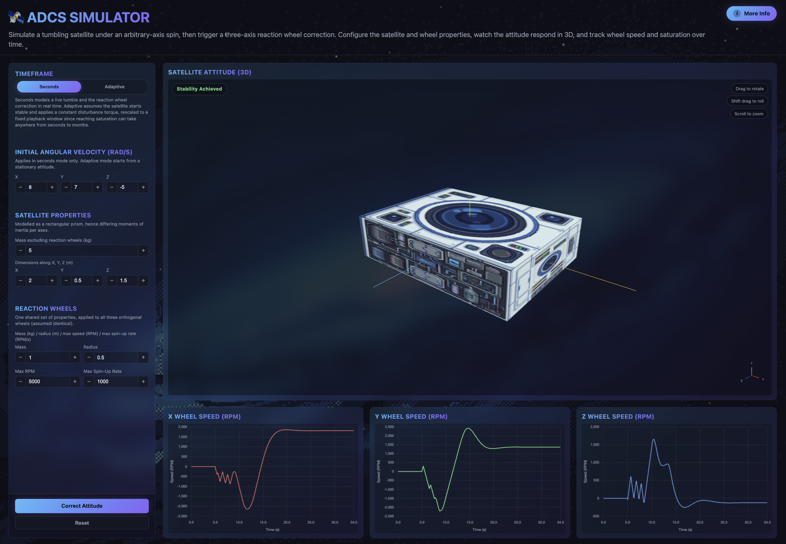

# ADCS Simulator

A web-based spacecraft attitude simulator. A satellite tumbles freely under an arbitrary initial angular velocity, then a three-axis reaction wheel controller drives it back to a target attitude, with wheel speed and saturation tracked throughout. The physics engine is a Python backend served through a Flask REST API, with a 3D browser frontend for visualisation.

**Live App:** [vedanth-warrier.github.io/ADCS-Simulator/](https://vedanth-warrier.github.io/ADCS-Simulator/)
**Backend API:** [attitude-determination-and-control.onrender.com](https://attitude-determination-and-control.onrender.com) (free Render tier, the first request after idling can take up to a minute while the service wakes)

## Authorship

The backend (`dynamics.py`, `app.py`), covering all dynamics, control and API code, was written by Vedanth Warrier. The frontend (`index.html`, `script.js`, `style.css`) was generated entirely by Claude (Anthropic) and is not claimed as original work. `CLAUDE.md` was the initial specification file used to direct that generation (now outdated after many design changes).

## Overview

The satellite is modelled as a rigid rectangular prism, so each body axis has a different moment of inertia. For an asymmetric body, torque-free rotation about a non-principal axis does not stay about a fixed axis: gyroscopic coupling between axes produces precession, which is the tumble the controller has to correct.

The physics engine accounts for:
- Quaternion attitude kinematics (no gimbal lock)
- Euler's rigid-body equations with full gyroscopic coupling
- Reaction wheel angular momentum coupled into the body dynamics
- Wheel torque limits (maximum spin-up rate) and momentum limits (maximum RPM)
- Per-axis wheel saturation under a constant disturbance torque

## State Vector

Seven states: a scalar-last attitude quaternion and the body angular velocity.

$$\mathbf{x} = \begin{bmatrix} q_1 & q_2 & q_3 & q_4 & \omega_x & \omega_y & \omega_z \end{bmatrix}^T$$

## Equations of Motion

**Quaternion kinematics**, with $\mathbf{q}_v = [q_1, q_2, q_3]^T$ and $\boldsymbol{\omega}$ in the body frame:

$$\dot{\mathbf{q}}_v = \frac{1}{2}\left(q_4\ \boldsymbol{\omega} + \mathbf{q}_v \times \boldsymbol{\omega}\right)$$

$$\dot{q}_4 = -\frac{1}{2}\mathbf{q}_v \cdot \boldsymbol{\omega}$$

**Euler's rigid-body equations** with stored wheel momentum $\mathbf{h}_w$ and applied torque $\boldsymbol{\tau}$:

$$\mathbf{I}\dot{\boldsymbol{\omega}} = \boldsymbol{\tau} - \boldsymbol{\omega} \times \left(\mathbf{I}\boldsymbol{\omega}\right) - \boldsymbol{\omega} \times \mathbf{h}_w$$

**Moment of inertia** (solid box, principal axes aligned with the body axes), where $m$ includes the mass of all three wheels:

$$I_{xx} = \frac{m}{12}\left(y^2 + z^2\right), \quad I_{yy} = \frac{m}{12}\left(x^2 + z^2\right), \quad I_{zz} = \frac{m}{12}\left(x^2 + y^2\right)$$

**Reaction wheels** are modelled as solid disks, with wheel speed $\Omega$ in rad/s:

$$I_w = \frac{1}{2} m_w r_w^2, \qquad h_w = I_w \Omega$$

Integration uses `scipy.integrate.solve_ivp` with dense output, and the quaternion is renormalised after every integration step to remove numerical drift.

## Attitude Controller

A quaternion-error PD controller with inertia-scaled gains and a feedforward term that cancels the gyroscopic coupling:

$$\boldsymbol{\tau}_c = K_p\mathbf{I}\mathbf{e}_v - K_d\mathbf{I}\boldsymbol{\omega} + \boldsymbol{\omega} \times \left(\mathbf{I}\boldsymbol{\omega}\right) + \boldsymbol{\omega} \times \mathbf{h}_w$$

The error quaternion $\mathbf{e}$ is taken against the identity attitude and sign-flipped so that $e_4 \geq 0$, which forces the shortest rotation path. With the coupling cancelled and the gains scaled by inertia, every axis follows the same decoupled closed-loop dynamics:

$$\dot{\boldsymbol{\omega}} = K_p\mathbf{e}_v - K_d\boldsymbol{\omega}$$

**Discrete implementation:** the control torque is recomputed every 0.05 s (20 Hz) and held constant across each step. The body receives $+\boldsymbol{\tau}_c$ and each wheel absorbs the reaction:

$$\Omega_{k+1} = \Omega_k - \frac{\tau_c\Delta t}{I_w}$$

**Actuator limits**, applied per axis every step:
- **Torque limit:** if the commanded torque would need a spin-up rate above the wheel's maximum, it is clipped to that maximum.
- **Momentum limit:** if a wheel reaches its maximum RPM, it is held there and supplies no further torque on that axis. An axis that finishes the run pinned at maximum RPM is flagged as saturated.

The correction runs until every quaternion vector component and every body rate is below $10^{-3}$, or until 100 s of correction time has elapsed.

## Simulation Modes

### Seconds

Three phases, played back in real time:
1. **Torque-free precession:** 5 s of free tumble under the initial angular velocity, no control applied.
2. **Correction:** the reaction wheels drive the satellite back to the identity attitude with zero body rate.
3. **Hold:** 5 s with the wheels held at their final speeds, confirming the attitude has settled.

No disturbance torque acts in this mode, since the correction timescale is far shorter than the timescale over which disturbances accumulate.

### Adaptive

The satellite starts at rest and a constant disturbance torque $\boldsymbol{\tau}_d$ of user-defined magnitude and direction acts continuously. Each wheel absorbs its share of the disturbance until it reaches maximum RPM, with the per-axis time to saturation given by:

$$t_{sat,i} = \frac{I_w\Omega_{max}}{\left|\tau_{d,i}\right|}$$

Since saturation can take anywhere from seconds to months, the result is rescaled onto a fixed 100 s playback window, driven by the slowest axis to saturate.

## Assumptions and Limitations

- Rigid rectangular prism with principal axes aligned to the body axes. Wheel mass is distributed through the box inertia, and wheel spin-axis inertia is not added separately to the body inertia.
- Perfect state knowledge: attitude and rate are read directly from the simulated state, with no sensor or estimation model.
- Base controller gains are fixed at $K_p = K_d = 1$ and scaled from there according to the moments of inertia over each axis.
- The disturbance torque is a single user-defined stand-in for the combined effect of solar radiation pressure, atmospheric drag, gravity gradient and similar sources. Deriving these from orbital and geometric parameters is out of scope.
- Adaptive mode is an analytic momentum-accumulation model and does not propagate attitude.
- No momentum dumping (magnetorquers or thrusters), so a saturated wheel stays saturated.
- The tumble shown before "Correct Attitude" is pressed is a kinematic preview in the frontend at a fixed spin axis, not a physics result. The physically modelled precession begins once the button is pressed.

## Tech Stack

| Tool | Purpose |
|------|---------|
| Python | Core language (backend) |
| NumPy | Numerical computation |
| SciPy | ODE integration |
| Flask, flask-cors | REST API |
| Gunicorn, Render | Backend deployment |
| HTML, CSS, JavaScript, Three.js, Chart.js | Frontend (generated by Claude, see Authorship) |
| GitHub Pages | Frontend hosting |

## Skills Demonstrated

- Rigid-body rotational dynamics and quaternion kinematics
- Closed-loop attitude control with gyroscopic feedforward
- Reaction wheel momentum management and saturation modelling
- Numerical integration of coupled nonlinear ODEs
- REST API design and backend deployment
